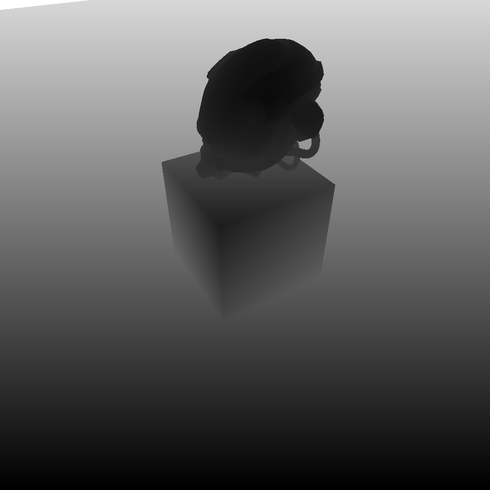
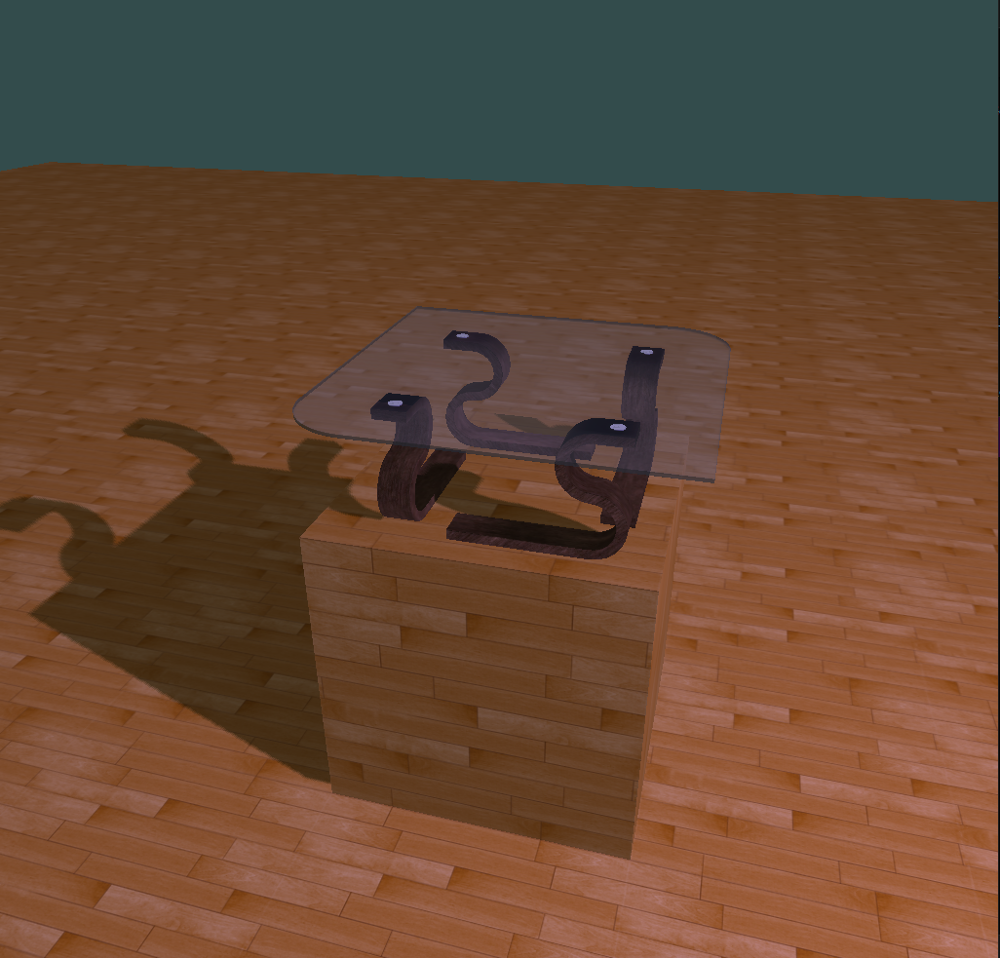

# OpenGL 基础应用

## 说明

OpenGL 渲染实践，涉及模型加载，顶点缓存对象，纹理映射，材质封装，着色器封装，基础光照模型计算，阴影（Shadow Mapping），帧缓存，Uniform 缓存对象，摄像机控制等方面的应用。

项目中使用的模型是 [tinyrender](https://github.com/ssloy/tinyrenderer) 、[SoftGLRender](https://github.com/keith2018/SoftGLRender) 中的开源模型。

## 示例

|                               |                                |
|-------------------------------|--------------------------------|
|    |       |
|    |       |

## 功能

- ModelLoader 类，封装了模型加载操作，包括加载模型、加载纹理、创建材质等。
  - `class ModelLoader` : source/Model/ModelLoader.hpp
- VertexArrayObject 类，封装了 VAO 的生成、绑定、传递数据等操作。
  - `class VertexArrayObject` : source/Render/VertexArrayObject.hpp
- Texture 类，封装了纹理属性，采样器属性以及与纹理相关的操作。
  - `class Texture` : source/Render/Texture.hpp
  - `class Texture2D` : source/Render/Texture2D.hpp
- Material 类，封装了材质属性，如基础色、采用的着色器、对应的纹理数据，定义了与 Uniform Buffer Object 对应的数据结构，还提供了材质应用相关的工具方法，如获取对用类型采样器在着色器中的名称。
  - `class Material` : source/Render/Material.hpp
- Framebuffer 类，封装与 Framebuffer 相关的生成、绑定、初始化、删除等操作。
  - `class Framebuffer` : source/Render/Framebuffer.hpp
- ShaderProgram 类，封装了着色器的源代码加载、编译、创建着色器对象、关联着色器程序、链接着色器程序以及使用着色器程序等操作。
  - `class ShaderProgram` : source/Render/ShaderProgram.hpp
- ShaderResource 类，封装了需要传递给着色器的数据，包括 Uniform Block 和 Uniform Sampler 两部分。
  - `class ShaderResource` : source/Render/ShaderResource.hpp
- Uniform 类，封装了与 Uniform Block 和 Uniform Sampler 相关的查询索引位置、绑定等操作。
  - `class UniformBase` : source/Render/UniformBase.hpp
  - `class UniformBlock` : source/Render/UniformBlock.hpp
  - `class UniformSampler` : source/Render/UniformSampler.hpp
- Camera 类，封装了摄像机的位置、观察方向、视场角等属性，提供了获取视图、投影矩阵以及控制移动的方法。
  - `class Camera` : source/Viewer/Camera.hpp

## Render Framework Diagram（梳理中）

[RenderMap](https://github.com/dxm3dp/GLBase/blob/main/screenshot/RenderMap.png)

## 构建

```bash
git clone https://github.com/dxm3dp/GLBase.git
cd GLBase
mkdir build
cd build
cmake ..
cmake --build .
```

## 运行

```bash
cd GLBase/build
./GLBase.exe
```

## 目录结构

- `assets`: 存放模型文件和纹理贴图的目录。
- `source`: 主源代码目录。
  - `Common`: 通用工具类目录，包括文件读取、日志输出、内存分配等。
  - `Config`: 配置文件目录。
  - `Model`: 模型抽象类目录，包括模型网格类的封装、模型加载处理。
  - `Render`: 渲染抽象类目录，包括顶点数据、纹理、材质、着色器、渲染管线的封装。
  - `Shader`: 着色器文件目录。
  - `Viewer`: 目前只有摄像机类。
  - `main.cpp`: 主程序入口。
- `third_party`: 第三方库目录。

## Third Party Libraries

- `assimp` [https://github.com/assimp/assimp](https://github.com/assimp/assimp)
- `glfw` [https://github.com/glfw/glfw](https://github.com/glfw/glfw)
- `glm` [https://github.com/g-truc/glm](https://github.com/g-truc/glm)
- `stb_image.h` [https://github.com/nothings/stb](https://github.com/nothings/stb)

## 施工中

- Skybox 绘制
- 半透明物体阴影绘制
- 梳理 Render Framework Diagram

## 参考

教程

- `LearnOpenGL` [https://learnopengl.com/](https://learnopengl.com/)

项目

- `SoftGLRender` [https://github.com/keith2018/SoftGLRender](https://github.com/keith2018/SoftGLRender)
