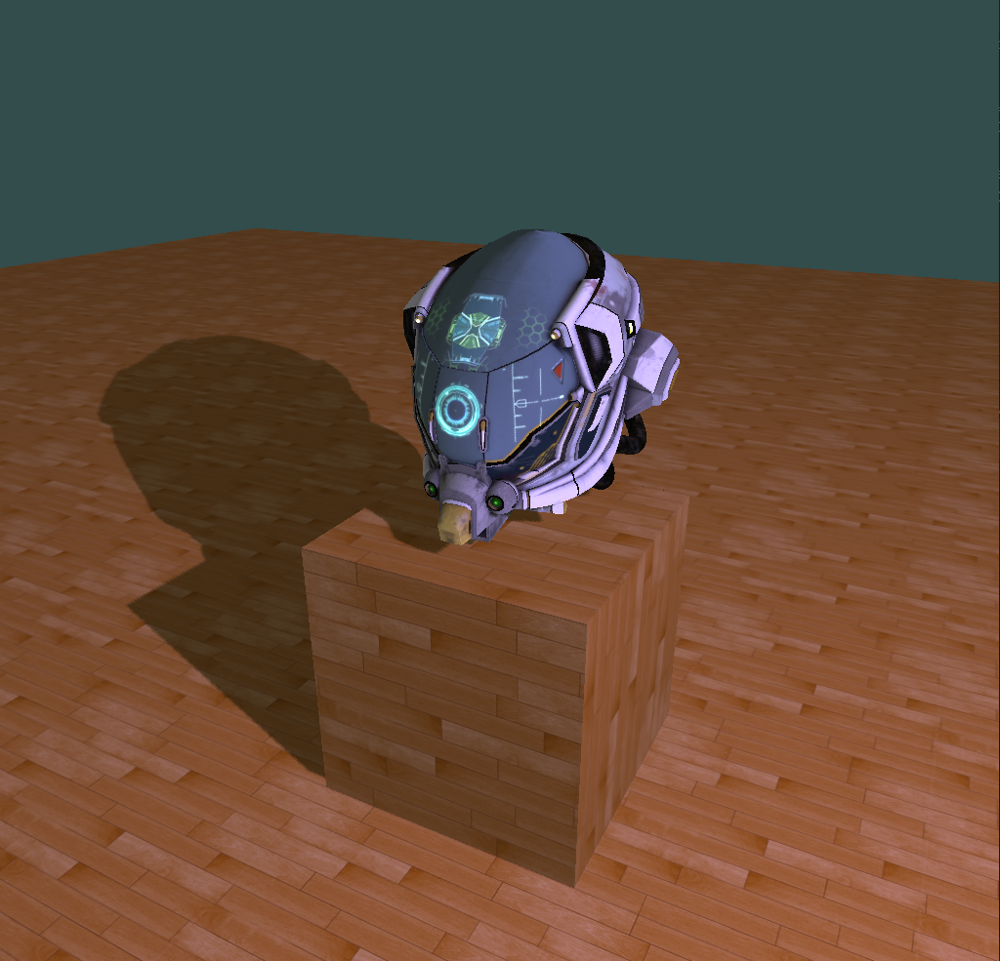
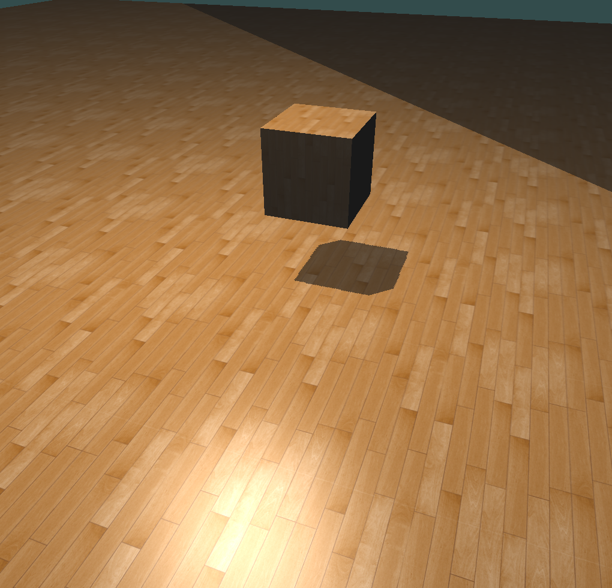

# OpenGL 基础应用

## 说明

项目中使用的模型是 [tinyrender](https://github.com/ssloy/tinyrenderer) 、[SoftGLRender](https://github.com/keith2018/SoftGLRender) 中的开源模型。

## 示例

|                               |                                |
|-------------------------------|--------------------------------|
|    |       |

## 功能

- Vertex Array Object
- Vertex Shader
- Fragment Shader
- Blinn-Phong Shading
- Multiple Lights
- Uniform Buffer Object
- Shadow Mapping
- Multi-Threaded Texture Loading
- Camera Control

## 构建

```bash
git clone https://github.com/dxm3dp/GLBase.git
cd GLBase
mkdir build
cd build
cmake ..
cmake --build .
```

## 运行

```bash
cd GLBase/build
./GLBase.exe
```

## 目录结构

- `assets`: 存放模型文件和纹理贴图的目录。
- `source`: 主源代码目录。
  - `Common`: 通用工具类目录，包括文件读取、日志输出、内存分配等。
  - `Config`: 配置文件目录。
  - `Model`: 模型抽象类目录，包括模型网格类的封装、模型加载处理。
  - `Render`: 渲染抽象类目录，包括顶点数据、纹理、材质、着色器、渲染管线的封装。
  - `Shader`: 着色器文件目录。
  - `Viewer`: 目前只有摄像机类。
  - `main.cpp`: 主程序入口。
- `third_party`: 第三方库目录。

## Third Party Libraries

- `assimp` [https://github.com/assimp/assimp](https://github.com/assimp/assimp)
- `glfw` [https://github.com/glfw/glfw](https://github.com/glfw/glfw)
- `glm` [https://github.com/g-truc/glm](https://github.com/g-truc/glm)
- `stb_image.h` [https://github.com/nothings/stb](https://github.com/nothings/stb)

## 参考

教程

- `LearnOpenGL` [https://learnopengl.com/](https://learnopengl.com/)

项目

- `SoftGLRender` [https://github.com/keith2018/SoftGLRender](https://github.com/keith2018/SoftGLRender)
