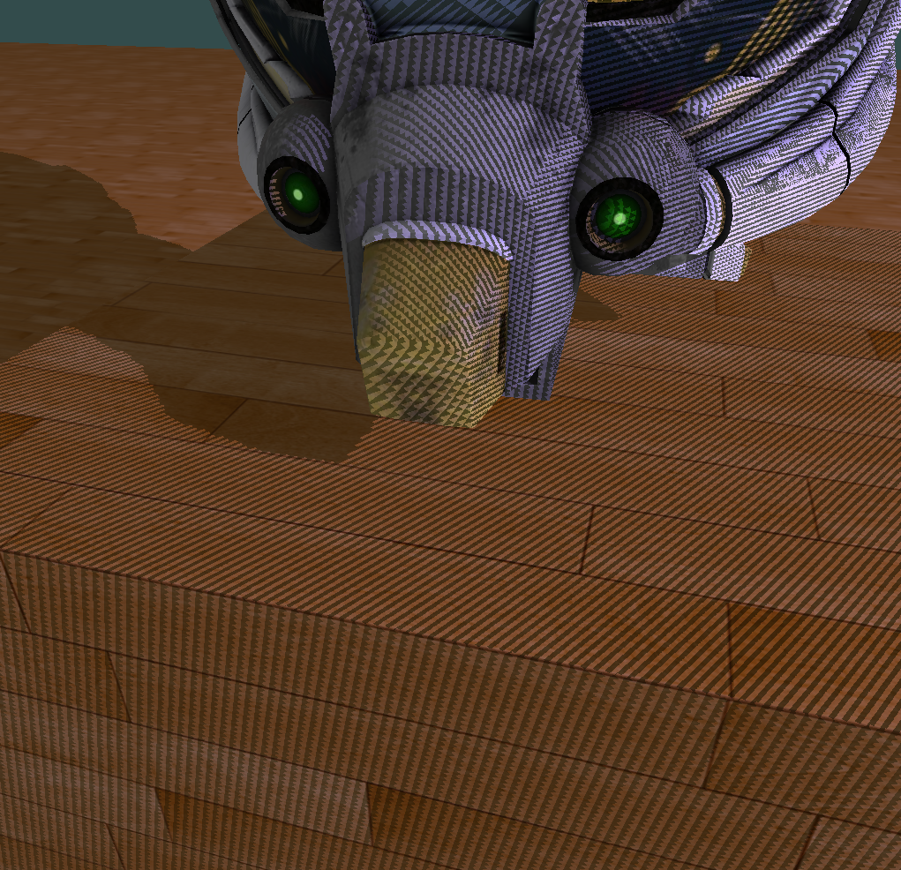
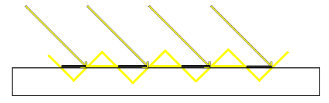
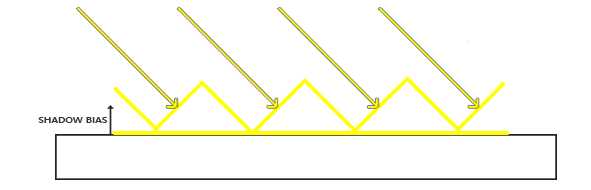
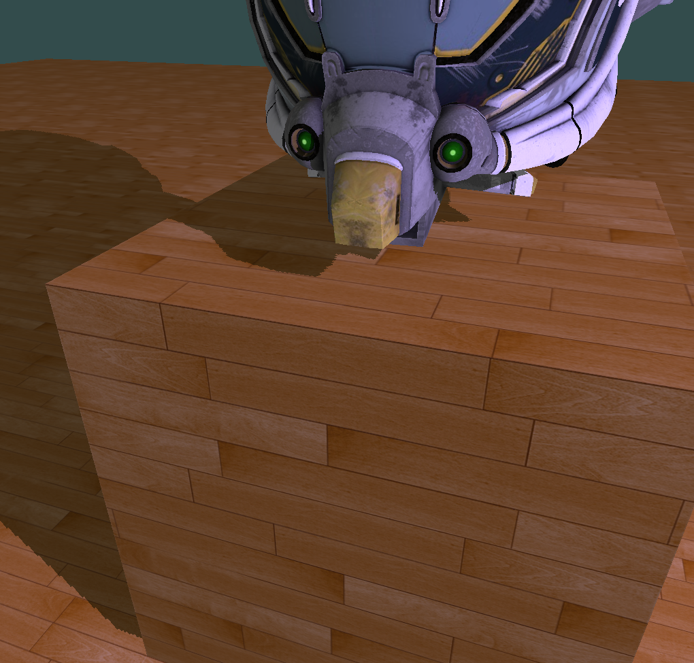

# Shadow Mapping

## Shadow acne

Shadow acne 应该翻译成什么，不是很确定。总之它是一种实现 Shadow mapping 过程中产生的 artifact（瑕疵），直接看一下它对应的现象就会比较清楚：

<div align="center">
  
</div>

我们可以清晰的看到，在物体表面形成了一种明暗交替类似摩尔纹的效果，这就是 Shadow acne。那么产生这种现象的原因是什么呢？用一句话总结就是：深度图的精度不够所致。下面我们具体分析一下。

在实现 Shadow Mapping 过程中，会用到 2 个 Pass，第 1 个 Pass 从光源视角渲染场景的深度图，第 2 个 Pass 从相机视角渲染场景并根据第 1 个 Pass 渲染得出的深度图计算阴影。关键在于这张深度图它有固定的分辨率，比如 512 * 512 或 1024 * 1024。那么在对它进行采样时，由于分辨率的限制，就会出现多个片元采样到深度图上同一个纹素的情况。如下图所示，图中的黄色斜坡表示深度图的一个个纹素，下方的矩形表示地板平面。因为渲染深度图时是从光源视角出发的，而光照方向通常与物体表面都会存在一个夹角，渲染深度图时也就存在这样一个夹角。这就导致出现了图中所表示的情况，深度图的某些纹素一部分在地板平面上，一部分在地板平面下，导致渲染得到的阴影产生差异，产生这种明暗相间的条纹效果。

<div align="center">
  
</div>

解决这个问题的技术叫做 Shadow bias（阴影偏移），它的思想很简单，对物体的表面或者深度图应用一个偏移，以避免深度图纹素进入表面之下的情况出现。

<div align="center">
  
</div>

至于这个偏移给多大合适，肯定不是一个固定值，需要根据光照方向和物体表面法线的夹角大小来进一步确定，计算方式如下：

```cpp
const float depthBiasCoeff = 0.00025;
const float depthBiasMin = 0.00005;
float bias = max(depthBiasCoeff * (1.0 - dot(normal, worldLightDir)), depthBiasMin);
```

这样一来我们就可以根据物体表面法线方向与光照方向的夹角变化，得到一个变化的 bias 范围。物体表面法线方向与光照方向夹角越大，bias 越大，反之则越小。通过这种方式，我们得到调整后的渲染结果如下，可以看到情况好了很多。

<div align="center">
  
</div>
